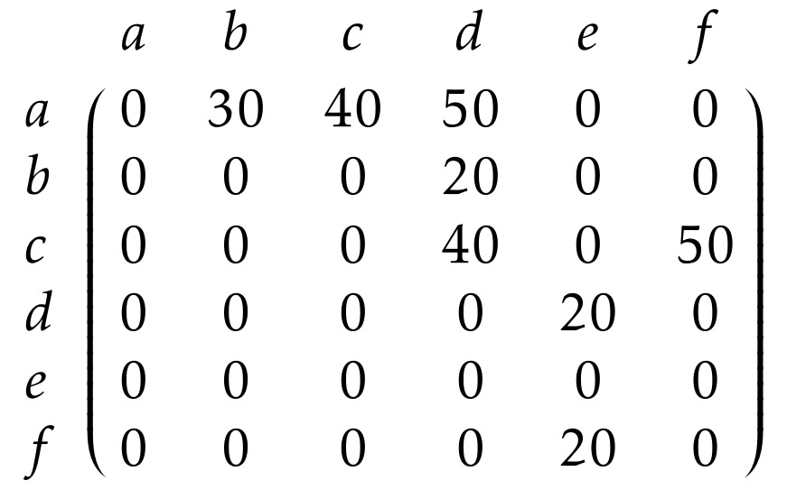
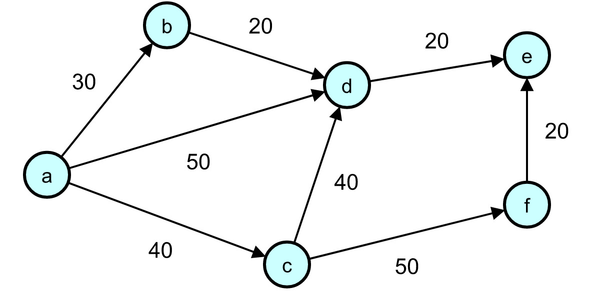

# Caminho entre vértices recursivo

Esta é uma variação do algortimo de busca por profundidade em um grafo que usa recursão ao invés de pilha.

## Objetivos

O objetivo deste código é que o usuário crie o próprio grafo e descubra o custo entre dois determinados vértices (escolhidos por ele), caso exista um caminho. Se não houver caminho, o usuário receberá `-1` como resposta.

Este projeto é uma adaptação de um código usado no trabalho de Estrutura de Dados 1, da Universidade Federal de Uberlândia (UFU). No trabalho, deveríamos desenvolver um programa de busca em grafo usando o algoritmo de busca por profundidade com pilhas. Porém, ao realizar o trabalho percebi que seria possível implmentá-lo por meio da recursão, deixando o código mais elegante e eliminando a necessidade do uso da pilha. Por isso decidi implementá-lo assim como um desafio.

Para interessados, o PDF contendo as informações do trabalho pode ser acessado [clicando aqui](/resources/instrucoes-para-trabalho-01).

## Uso

Use o comando `./grafo-recursivo` para rodar o programa.

Uma vez dentro dele, a execução seguirá pelo seguinte: 

```
Digite a quantidade de vertices e a quantidade de arestas (respectivamente): 6 8
Digite os vertices a serem vizinhos e o custo da aresta que os conecta (respectivamente):
1 2 30
1 3 40
1 4 50
2 4 20
3 4 40
3 6 50
4 5 20
6 5 20
```

Em seguida, será printado o grafo na tela, conforme esta imagem:



No caso da imagem, as letras representam os nomes dos vértices que, no programa, foram substituidos pelos índices da matriz. Porém, optei por deixar os índices implícitos quando printasse o grafo.

```
000  030  040  050  000  000  
000  000  000  020  000  000  
000  000  000  040  000  050  
000  000  000  000  020  000  
000  000  000  000  000  000  
000  000  000  000  020  000  
```

Esta matriz representa o seguinte grafo



Após isso, será pedido que o usuário informe os vértices que quer buscar um caminho:

```
Digite os vertices para encontrar o caminho entre: 1 6
Custo do caminho: 90
```

Caso o caminho entre 1 e 6 não fosse possível, o programa retornaria `-1`.

Lembrando que caso queira ver o PDF do trabalho, basta [clicar aqui.](/resources/instrucoes-para-trabalho-01.pdf)

Espero que tenham gostado do projeto tanto quanto eu.